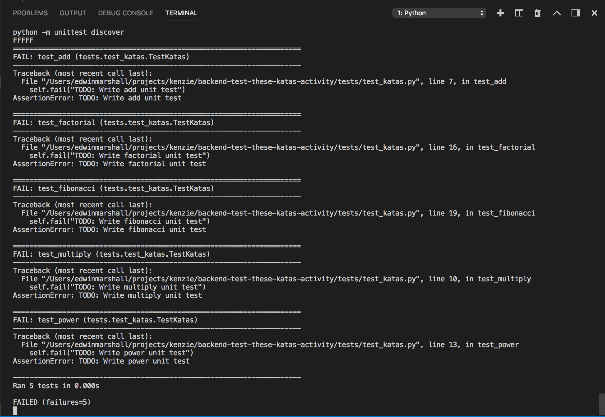
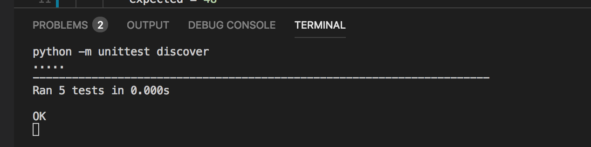

# Test These Katas
The [katas.py](katas.py) file includes our solution to the prior activity [Functions and Loops](https://github.com/KenzieAcademy/backend-katas-functions-loops).

Unfortunately, while we had good intentions and wrote a [test harness](./tests), we didn't actually write any unit tests!

## Testing with Unittest
By now, you should be familiar with how unit tests generally work in python.  Unit tests are collected in their own separate folder, and should never be mixed in with actual production code.  Up until now, you have written the code and the tests have been written for you. If you have ever peeked inside the tests folder, the test modules usually say "Students should not modify these tests".  For this assignment the flow is reversed:  We give you the code, and YOU write the tests!  It is perfectly fine to go back to previous projects to get an idea of what a unittest module looks like, so you can get some ideas on how to structure this one.

There is a handy command-line utility out there called `rerun` (**pip install rerun**), which can help when running tests.

    ```console
    % rerun "python -m unittest discover tests"
    ```
This will watch your project directory for any file changes, and run the tests automatically each time you make a file change. You should see something like the following:



Then, open up [tests/test_katas.py](./tests/test_katas.py) and start fixing those TODOs!

Once complete, you should see the following test output:




Of course, you can also run and debug these same tests using the `Test Explorer` extension built in to the VSCode editor, by enabling automatic test discovery.  This is a really useful tool and we highly recommend to learn it.

https://code.visualstudio.com/docs/python/testing#_test-discovery

- Test framework is `unittest`
- Test folder pattern is `tests`
- Test name pattern is `test*`

## Writing the Tests
Each test you write should have at least one `assert` or `self.assertXXXXX` where it checks an actual return value against an expected value.

 - **add**: Generate some random integers or floats using the `random` library.  Does the `add` function in katas.py add the numbers together correctly?  Does the function handle negative values correctly?
 - **multiply**: Write tests similar to the `add` function tests.
 - **power**: Does the function handle positive integers correctly?  The function should raise a [`ValueError`](https://docs.python.org/3/library/exceptions.html#ValueError) exception if you provide a negative or fractional exponent value.  How can you test if a function raises an exception?  (Hint: explore the assertion methods available in [Unittest.TestCase](https://docs.python.org/3/library/unittest.html#unittest.TestCase) parent class)
 - **factorial**: Set up a list of the first 15 terms of the factorial series as literal integer values.  Make sure the function returns the correct values when iterating through values of n.  Does the function raise a `ValueError` if you give it negative values?
 - **fibonacci**: Test if the function can produce the first 30 terms of the fibonacci sequence.  Make sure that it raise a `ValueError` exception when given a negative number.

## Submitting your work
This excercise may be provided as a graded assignment, or an ungraded Activity.
To submit your solution for grading, you will need to create a github [Pull Request (PR)](https://docs.github.com/en/github/collaborating-with-issues-and-pull-requests/about-pull-requests).  Refer to the `PR Workflow` article in your course content for details.

